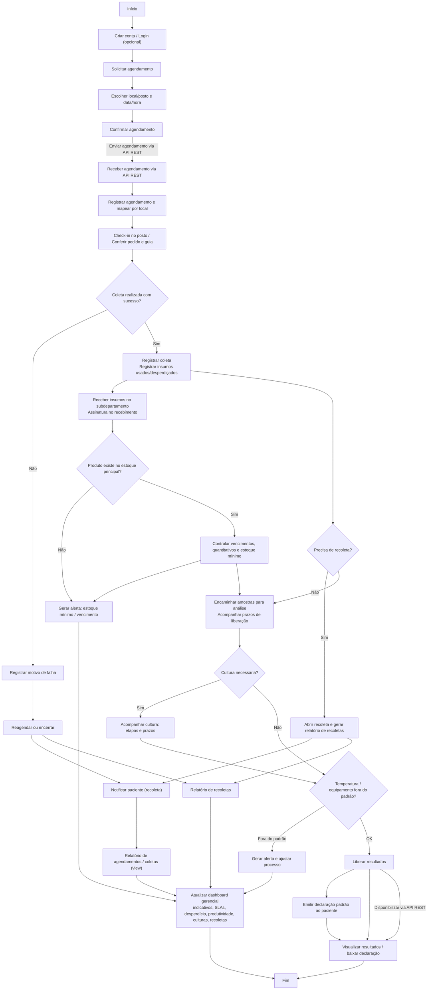

```mermaid
flowchart TD
%% Nodes
  n0[Início]
  n1["Criar conta / Login (opcional)"]
  n2[Solicitar agendamento]
  n3[Escolher local/posto e data/hora]
  n4[Confirmar agendamento]
  n5[Receber agendamento via API REST]
  n6[Registrar agendamento e mapear por local]
  n7[Check-in no posto / Conferir pedido e guia]
  n8{Coleta realizada com sucesso?}
  n9[Registrar motivo de falha]
  n10[Reagendar ou encerrar]
  n11["Notificar paciente (recoleta)"]
  n12["Relatório de agendamentos / coletas (view)"]
  n13[Relatório de recoletas]
  n14["Registrar coleta<br/>Registrar insumos usados/desperdiçados"]
  n15{Precisa de recoleta?}
  n16[Abrir recoleta e gerar relatório de recoletas]
  n17["Encaminhar amostras para análise<br/>Acompanhar prazos de liberação"]
  n18{Cultura necessária?}
  n19[Acompanhar cultura: etapas e prazos]
  n20{Temperatura / equipamento fora do padrão?}
  n21[Gerar alerta e ajustar processo]
  n22[Liberar resultados]
  n23[Emitir declaração padrão ao paciente]
  n24[Visualizar resultados / baixar declaração]
  n25["Atualizar dashboard gerencial<br/>indicativos, SLAs, desperdício, produtividade, culturas, recoletas"]
  n26[Fim]
  n27["Receber insumos no subdepartamento<br/>Assinatura no recebimento"]
  n28{Produto existe no estoque principal?}
  n29[Controlar vencimentos, quantitativos e estoque mínimo]
  n30[Gerar alerta: estoque mínimo / vencimento]

%% Edges
  n0 --> n1
  n1 --> n2
  n2 --> n3
  n3 --> n4
  n4 -->|Enviar agendamento via API REST| n5
  n5 --> n6
  n6 --> n7
  n7 --> n8
  n8 -->|Não| n9
  n8 -->|Sim| n14
  n9 --> n10
  n10 --> n11
  n10 --> n13
  n11 --> n12
  n12 --> n25
  n14 --> n27
  n14 --> n15
  n15 -->|Sim| n16
  n15 -->|Não| n17
  n16 --> n11
  n16 --> n13
  n17 --> n18
  n18 -->|Sim| n19
  n18 -->|Não| n20
  n19 --> n20
  n20 -->|Fora do padrão| n21
  n20 -->|OK| n22
  n21 --> n25
  n22 --> n23
  n22 --> n24
  n22 -->|Disponibilizar via API REST| n24
  n23 --> n24
  n24 --> n26
  n25 --> n26
  n13 --> n25

  n27 --> n28
  n28 -->|Não| n30
  n28 -->|Sim| n29
  n29 --> n30
  n29 --> n17
  n30 --> n25
```
